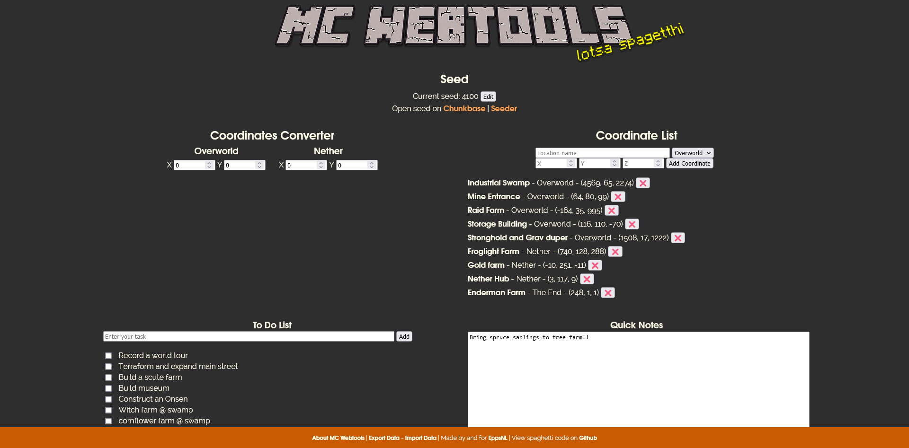

# mc-webtools
  

A webpage with basic tools to use in Minecraft Java Edition. A live version can be found at https://mc.epps.nl with no guarantuee on long-term availablity or support. I am not a coder, just someone who can read and edit code enough to cobble something together that's "good enough" for personal use.

## Features
- Seed: Display your current seed and have direct links to its seed maps  Chunkbase and Seeder.
- Overworld <-> Nether Coordinates conversion: No more multiplying and dividing by 8 manually. Rounds to the nearest whole number automatically.
- Coordinate List: Keep track of your bases, farms and other points of interest. This list is automatically sorted by world dimension and location name.
- To Do List: Stay organised in your journey to make the biggest, baddest world of them all.
- Quick Notes: Because very builder needs a place to temporarily drop a list of items to bring.
- Backup And Restore Data: Perfect for running multiple worlds or to bring your data on the road.
- Data Privacy: All data entered is stored client-side in the browsers localstorage, easiliy accesable through the dev console (F12).